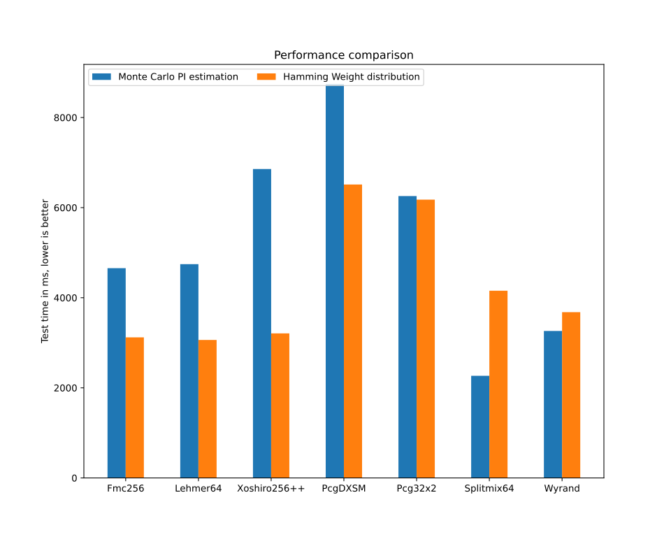

# Folded Multiply-with-Carry PRNG

An implementation of Marsaglia's Multiply-With-Carry generators, with an extra
scrambling operation of folding the upper and lower halves of the
multiplication result.

## Usage

If you just want the generator, here it is in C, porting to other languages
should be pretty trivial.

```c
typedef struct {
  uint64_t state[3];
  uint64_t carry;
} Fmc256;

#define MUL 0xfffcb1af7d963b55

Fmc256 Fmc256_new(uint64_t seed[4]) {
  Fmc256 rng;
  memcpy(&rng, seed, sizeof(rng));
  rng.carry = rng.carry % (MUL - 2) + 1;
  return rng;
}

uint64_t Fmc256_next(Fmc256 *rng) {
  uint64_t result = rng->state[2] ^ rng->carry;
  __uint128_t m = (__uint128_t)rng->state[0] * MUL + rng->carry;
  rng->state[0] = rng->state[1];
  rng->state[1] = rng->state[2];
  rng->state[2] = m;
  rng->carry = m >> 64;
  return result;
}
```

### Zig version

Other than the minimal C version above, there is also the Zig version provided
[here](src/Fmc256.zig). It has a richer seeding API:

```zig
var rng1 = Fmc256.fromBytes(&.{ 42 });
var rng2 = Fmc256.fromBytes("an arbitrarily long string");

// Use the operating system's entropy
var rng3 = Fmc256.fromSeed(seed: {
  var seed: [4]u64 = undefined;
  try std.posix.getrandom(@ptrCast(&seed));
  break :seed seed;
});
```

And supports efficient jump-ahead:

```zig
rng.jump(.steps(n));          // runtime jump (O(log n))
rng.jump(comptime .steps(n)); // compile-time jump (O(1) at runtime)

// Creating parallel streams, a default jump is provided for this purpose
const rng1 = rng;
rng.jump(.default);
const rng2 = rng;
rng.jump(.default);

try std.Thread.spawn(.{}, work1, .{ args1, rng1 });
try std.Thread.spawn(.{}, work2, .{ args2, rng2 });
```

The rest of this repository contains code for configuring and testing the PRNG.
They are not important unless you want to reproduce the result or check for
correctness.

## Speed comparison

It's hard to evaluate the speed of PRNGs as there are many factors that affect
performance. But here's a rough estimation of how `Fmc256` performs against
some other popular PRNG.

Test environment:
- Zig version: 0.14.0
- OS: Linux 6.6.80, NixOS, 24.11 (Vicuna)
- CPU: AMD Ryzen 7 5800U

| Generator    | Period  | Monte Carlo PI estimation | Hamming weight distribution |
| ------------ | ------- | ------------------------- | --------------------------- |
| Fmc256       | ≈2^255  | 4656ms                    | 3120ms                      |
| Lehmer64     | 2^126   | 4745ms                    | **3062ms**                  |
| Xoshiro256++ | 2^256   | 6857ms                    | 3208ms                      |
| PcgDXSM      | 2^128   | 8741ms                    | 6513ms                      |
| Pcg32x2      | 2^63    | 6257ms                    | 6177ms                      |
| Splitmix64   | 2^64    | **2267ms**                | 4155ms                      |
| Wyrand       | 2^64    | 3262ms                    | 3679ms                      |



See [the source code](src/speed-test.zig) for more detail about the tests. We
can see that Fmc256 is in the same vicinity as the fastest generators in the
Hamming weight distribution test. For the Monte Carlo PI estimation test,
Fmc256 is only slower than small period generators (period less than 2^128).

## TODO

- [ ] 128-bit state, 64-bit output variant
- [ ] 128-bit state, 32-bit output variant
- [ ] Statistical quality assessment

## License

This project is licensed under the [MIT License](LICENCE).
